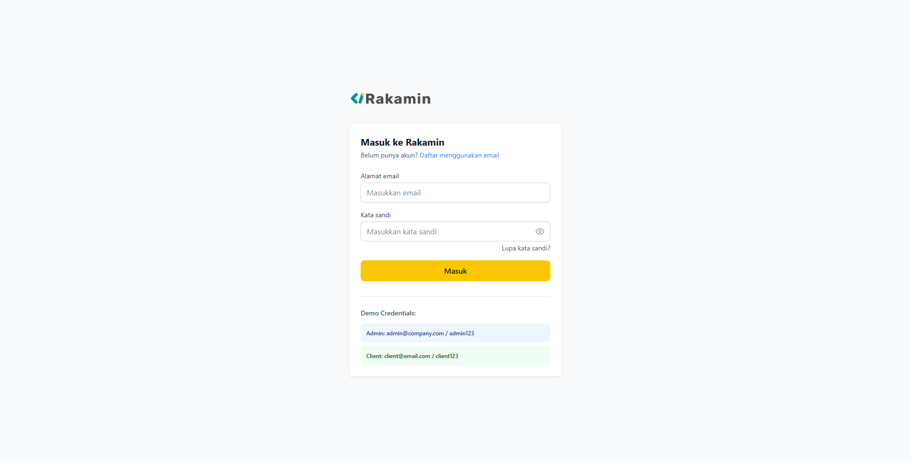

# Job Portal Application

## Project Overview

The Job Portal Application is a comprehensive platform designed to connect job seekers with employers. It features two distinct user roles: admin (recruiters) and regular users (job seekers). Admins can create and manage job postings, configure application forms, and review candidate applications. Job seekers can browse available positions, view job details, and submit applications with identity verification.



## Tech Stack Used

- **Frontend Framework**: React with TypeScript
- **Build Tool**: Vite
- **Styling**: Tailwind CSS
- **Routing**: React Router DOM
- **State Management**: React Context API
- **Form Handling**: Custom form validation
- **UI Components**: Custom components with Lucide React icons
- **Identity Verification**: TensorFlow.js with Handpose model
- **Notifications**: React Toastify

## How to Run Locally

1. **Clone the repository**
   ```
   git clone <repository-url>
   cd my-react-app
   ```

2. **Install dependencies**
   ```
   npm install
   ```

3. **Start the development server**
   ```
   npm run dev
   ```

4. **Access the application**
   Open your browser and navigate to `http://localhost:5173`

5. **Login credentials**
   - Admin: `admin@company.com` / `admin123`
   - User: `client@email.com` / `client123`

## Features

### Admin Features
- Manage job vacancies (create, edit, delete)
- Configure form fields for each job (mandatory/optional/hidden)
- View and manage job applicants
- Resizable and reorderable table columns

### User Features
- Browse active job vacancies
- View detailed job descriptions
- Apply with dynamic forms (based on admin configuration)
- Identity verification using hand gesture recognition
```
